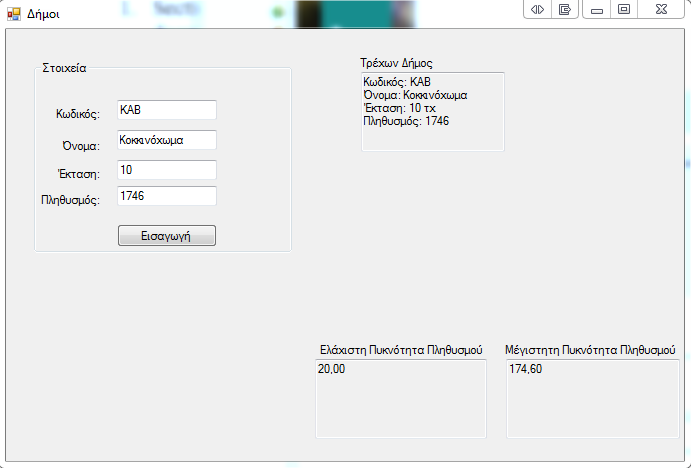

# Scope
This folder contains two programming assignments (written in `Visual Basic`), for a friend of mine studied at [TEI of Serres]

### Project1_Dimitrios
A console application that computes some custom weather metrics, for a given number of days.

  

### Project2_Dimitrios
A Windows form application that computes the acceptable population density range, for a given municipality.

  

[TEI of Serres]: http://www.teicm.gr/index.php?lang=en&cat_id=104
